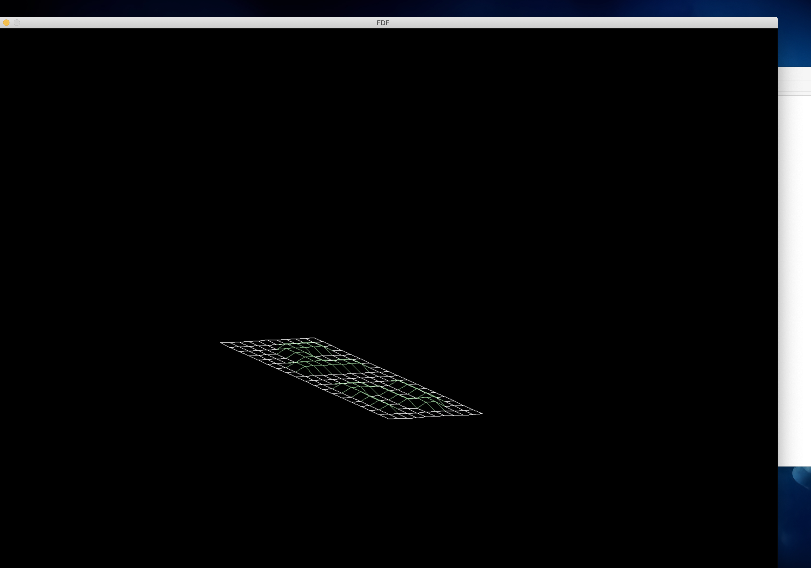
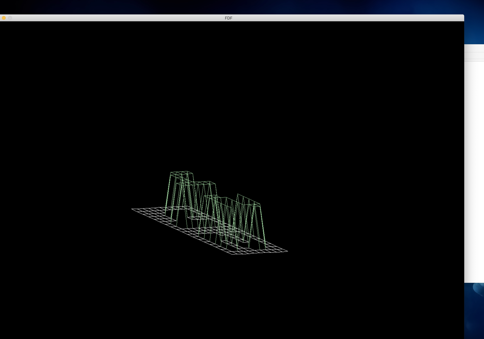
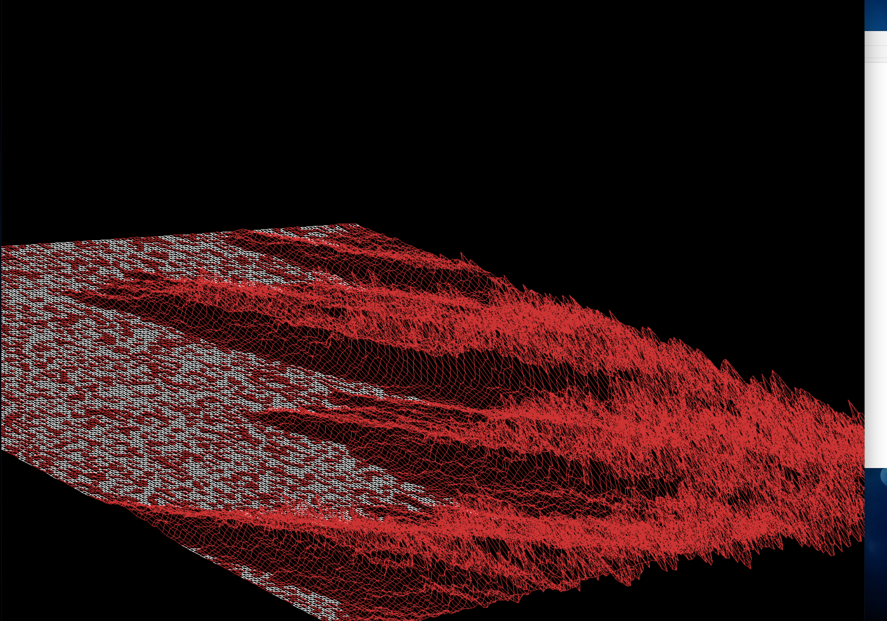
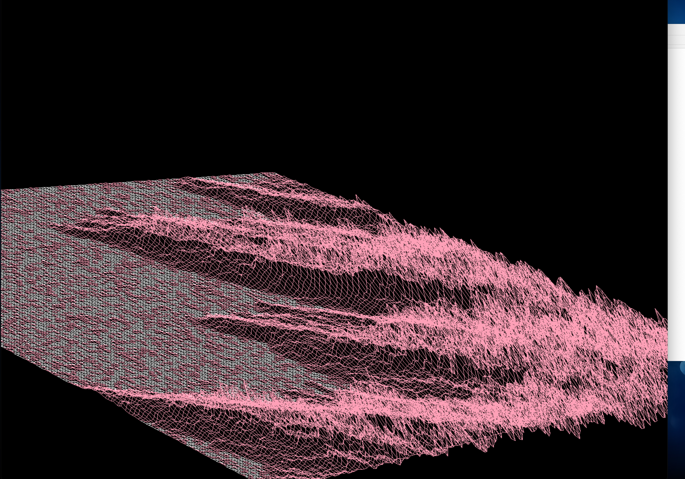
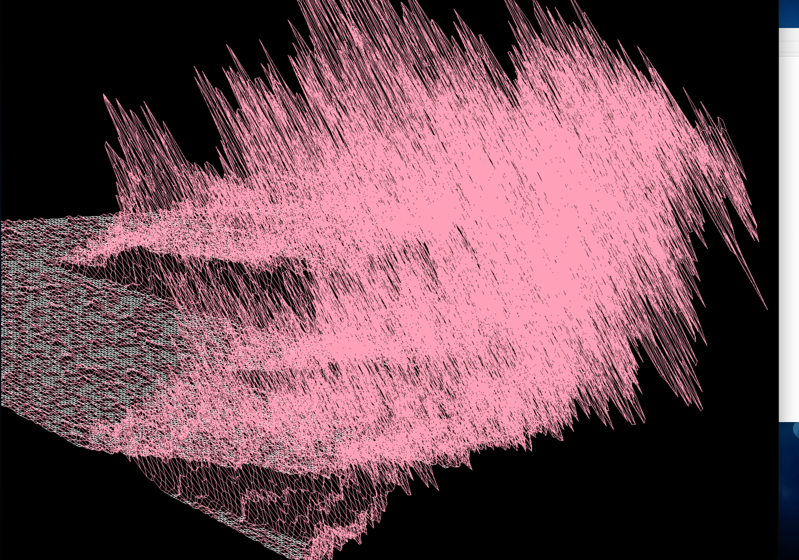
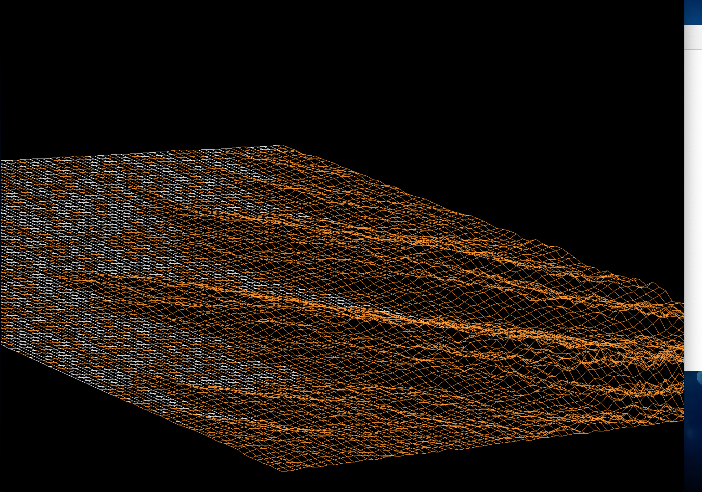

# FdF

### Library used
> -lmlx -framework OpenGL -framework AppKit

 &&
 
> minilibx_mms/libmlx.dylib

### how to run 

check [42 Docs](https://harm-smits.github.io/42docs/libs/minilibx/getting_started.html)

  

  

  

  

  

  

